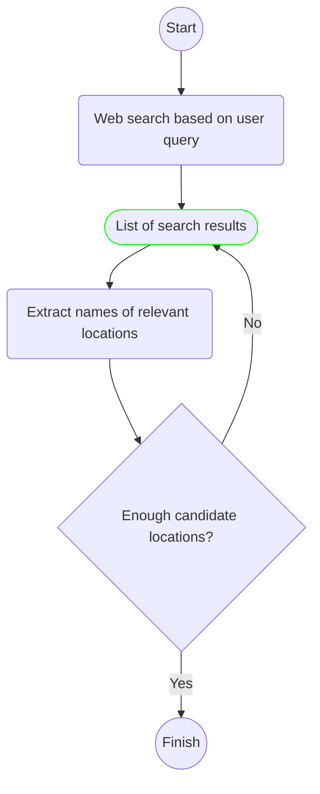
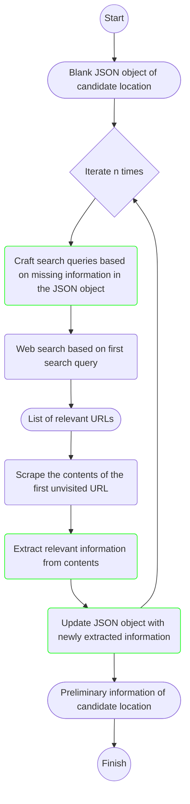
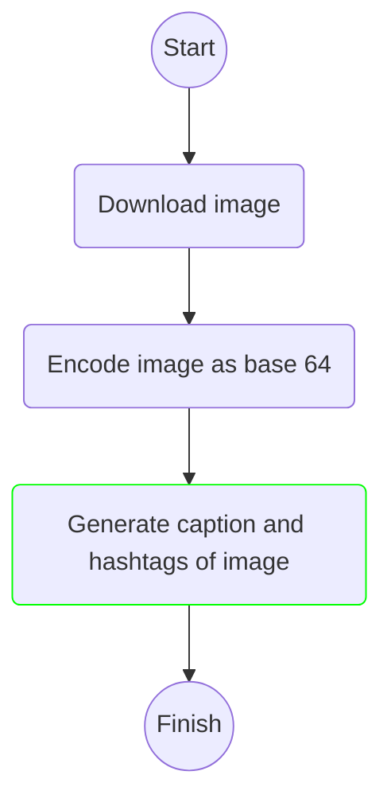

# Venue recommender
Auto-generate recommendations based on venue requirements

## Quickstart
The backend API requires the appropriate AWS credentials to function. Set `AWS_ACCESS_KEY_ID`, `AWS_SECRET_ACCESS_KEY`, and `AWS_SESSION_TOKEN` (needed if your account has MFA enabled) as environment variables. Run the following command to spin up the container:
```sh
docker compose up -d
``` 

The API endpoint is hosted on port `8000` by default, but this can be modified in "docker-compose.yml".

## Endpoints
The SwaggerUI for the API is hosted at http://localhost:8000/docs by default. The detailed documentation can be found in this [Postman collection](https://interstellar-meteor-840800.postman.co/workspace/New-Team-Workspace~61341a57-ebf4-45e2-9aa9-90c288cdd25b/collection/24411008-63434cf4-c082-4434-a1a8-ddb505f735db?action=share&creator=24411008).

## API internal flow
The internal flow of the API can be broken down into 3 main stages:
1. Identifying candidate locations
2. Retrieving relevant details of each candidate location
3. Captioning each image found

### 1. Identifying candidate locations
In this step, we are attempting to find the most relevant locations/venues based on the user query by scraping the contents of the relevant page(s) and extracting the names of these locations using an LLM.



### 2. Retrieving relevant details of each candidate location
In this step, we take the list of candidate locations generated in the previous stage and attempt to iteratively furnish the missing details of each location. We attempt to fill all information other than the image captions and hashtags here. Below we outline the steps taken for one candidate location:



### 3. Captioning each image found
In this step, we genrate caption and hashtags using a multimodal LLM (Amazon Nova) for each image extracted above. Below, we outline the steps taken for a single image:



## Challenges
Some of the challenges encountered along the way are documented [here](docs/challenges.md)
