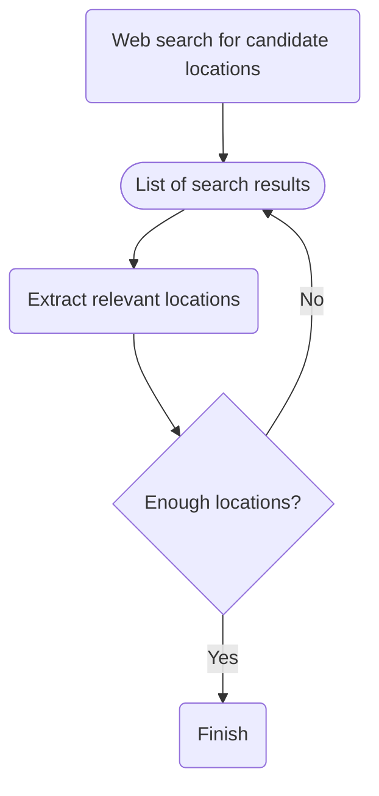
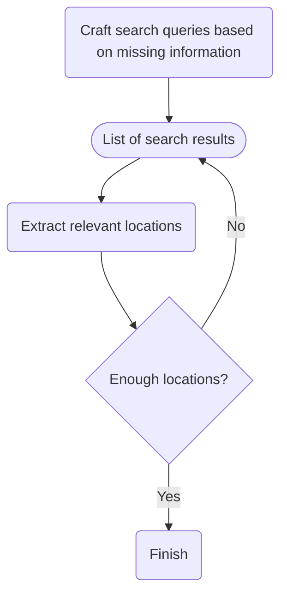

# Venue recommender
Auto-generate recommendations based on venue requirements

## Quickstart
The backend API requires the appropriate AWS credentials to function. Set `AWS_ACCESS_KEY_ID`, `AWS_SECRET_ACCESS_KEY`, and `AWS_SESSION_TOKEN` (needed if your account has MFA enabled) in "docker-compose.yml". Run the following command to spin up the container:
```sh
docker compose up -d
``` 

The API endpoint is hosted on port `8000` by default, but this can be modified in "docker-compose.yml".

## Endpoints
The SwaggerUI for the API is host at http://localhost:8000/docs by default. 

## API internal flow
The internal flow of the API can be broken down into 3 main stages:
1. Identifying candidate locations
2. Retrieving relevant details of each candidate location
3. Captioning each image found

### 1. Identifying candidate locations



### 2. Retrieving relevant details of each candidate location

